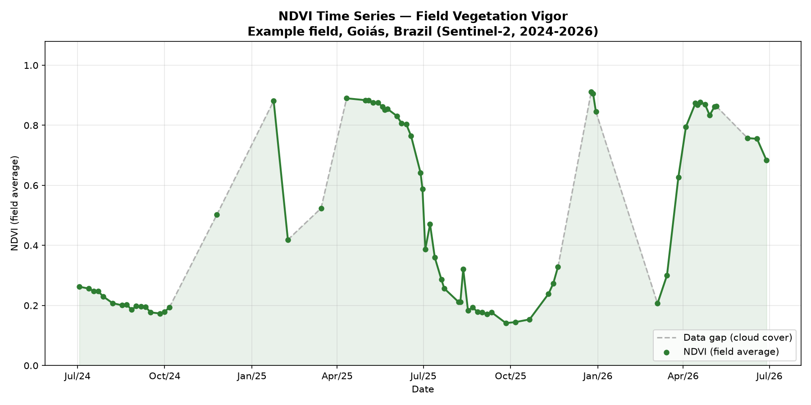

# Automated NDVI Monitoring for Agricultural Fields

Automated pipeline that generates NDVI (vegetation vigor) time series and
georeferenced rasters for agricultural fields, using Sentinel-2 satellite
imagery via the Google Earth Engine Python API.



## What this project does:

Given the boundary of a field (polygon coordinates) and a date range,
this pipeline automatically:

1. Retrieves all available low-cloud Sentinel-2 scenes over the field
2. Applies pixel-level cloud/shadow masking using the Scene
   Classification Layer (SCL)
3. Computes NDVI for each scene and extracts the field-average value to
   build a continuous vegetation vigor timeline
4. Flags significant data gaps caused by persistent cloud cover
   (marked as dashed segments in the chart, instead of being silently
   interpolated as a real trend)
5. Generates an annotated chart and a technical summary report
6. Exports georeferenced NDVI rasters (GeoTIFF) for spatial analysis in
   GIS software such as QGIS

## Why this matters?

Manually checking satellite imagery for crop monitoring across
multiple fields is slow and doesn't scale. This pipeline turns that
into a reproducible, automated process — the same code can be pointed
at any field, anywhere, by changing a handful of configuration values.

Typical applications:
- Early detection of vegetative stress or irregular crop development
- Remote monitoring of large landholdings without field visits
- Automated periodic reporting for farm management teams
- Multi-season historical pattern analysis

## Known limitation and roadmap

Optical satellites (Sentinel-2) cannot see through cloud cover, which
creates data gaps during the rainy season — visible as dashed segments
in the chart. **Planned v2:** incorporate Sentinel-1 (radar) imagery,
which penetrates clouds, to fill these gaps and produce a fully
continuous monitoring timeline.

## Project structure

```
calculate_ndvi.py        Main script: time series, chart, and report
export_raster.py         Exports a single georeferenced NDVI raster
export_all_rasters.py    Batch export of all rasters in the series
authenticate.py          One-time Earth Engine authentication
test_connection.py       Quick connectivity test
requirements.txt         Python dependencies
report.md                Generated technical report (example run)
ndvi_chart.png            Generated NDVI chart (example run)
ndvi_time_series.csv      Generated raw data (example run)
```

## How to run

1. Install dependencies:
   ```
   pip install -r requirements.txt
   ```

2. Authenticate with Google Earth Engine (one-time setup):
   ```
   python authenticate.py
   ```

3. Edit the configuration block at the top of `calculate_ndvi.py`
   (your Earth Engine project ID, field coordinates, and date range).

4. Run the main analysis:
   ```
   python calculate_ndvi.py
   ```

5. (Optional) Export rasters for use in QGIS:
   ```
   python export_all_rasters.py
   ```

## Tech stack

- Python
- Google Earth Engine Python API
- pandas
- matplotlib
- Sentinel-2 (Copernicus) satellite imagery

## About

Geospatial data automation for agriculture — combining field-level agronomic knowledge with GIS, remote sensing, and Python automation to deliver monitoring tools that
are both technically sound and agronomically meaningful.
